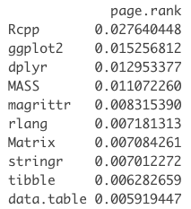
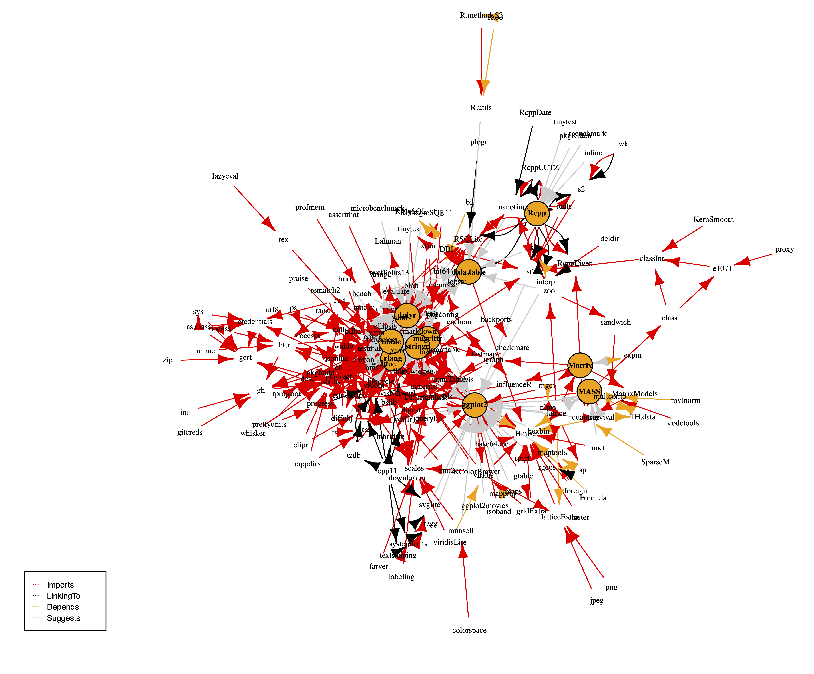
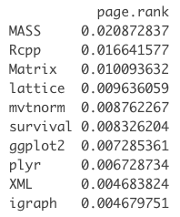
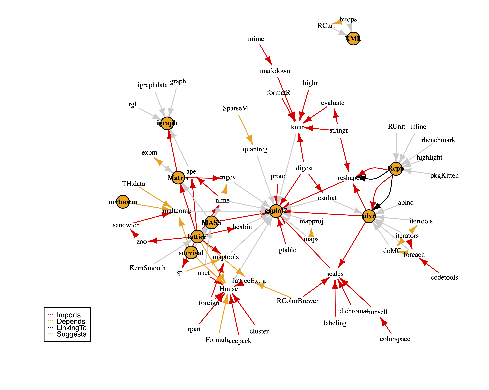

# CRAN Search Engine

By: Nelson Gil ([nelsonalejandrov](https://github.com/nelsonalejandrov)) and Adrian Tame ([AdrianTJ](https://github.com/AdrianTJ)).

## Outline

This project consists of three different parts that combined generate the final usable search engine: 

1. **Data extraction** from the [CRAN](https://cran.r-project.org/) (Comprehensive R Archive Network) and the [MRAN](https://mran.microsoft.com/rro) (Microsoft's R Application Network). We include an R Markdown file called `Rpackages.Rmd`  that does the data extraction fom the sources. We note that the date in like 18 has to be modified to any previous date, as the MRAN, which is where we get the list of packages available at that day, is updated daily for the packages available for the previous day. 

2. **Pagerank** generation in R. We follow the implementation detailed by Andrie de Vries in his excellent blog post [Finding the essential R packages using the pagerank algorithm (Revolutions)](https://blog.revolutionanalytics.com/2014/12/a-reproducible-r-example-finding-the-most-popular-packages-using-the-pagerank-algorithm.html). To achieve results for the modern CRAN, we take the packages in the CRAN up to a point (in the repository up to May 11th 2022), compared to the blog post that was last updated in December 2014. To get the pagerank, we first use the R package [igraph](https://cran.r-project.org/web/packages/igraph/index.html) to make the packages into a graph based on their dependencies, and then, use the `page_rank` function from the same package to calculate the desired quantity.

3. **TF-IDF based Cosine Similarity** is what we use to determine which package descriptions are most like the input query. We based our implementation on the top comment of this great [Stack Overflow question](https://stackoverflow.com/questions/8897593/how-to-compute-the-similarity-between-two-text-documents). While our data extraction and pagerank calculation is done in R, we decided it was best to implement the TF-IDF vectorizer in Python because we also have a flask app on top of our application which provides a basic GUI. We use [sklearn](https://scikit-learn.org/stable/modules/generated/sklearn.feature_extraction.text.TfidfVectorizer.html)'s implementation of the TF-IDF Vectorizer. 

## File Directory

* `RPackages.Rmd`: In this file we download the metadata for the R packages in the CRAN reposiory at a certain date. We download some variables, but the ones of interest to us are the package name, and the package dependencies. We then use miniCRAN to build a graph of package dependencies, the crucual step to be avle to calculate the pagerank, and apply the algorithm to the generated graph. We note that we consider this grapg as undirected, even if dependencies could be considered directed from the base package to the one it depends on. We tested a directed graph and the undirected one gave much better results. 

## How to Use and Deploy

## Implementation Details

### Pagerank

Originally invented by Sergey Brin and Larry Page, [the Page Rank algorithm](http://ilpubs.stanford.edu:8090/422/1/1999-66.pdf) was devised so that the web could be catalogued and ranked. In basic terms, Page Rank is an algorithm that provides a way of measuring the importance of web pages (or more generally, nodes in a graph). The `igraph` implementation that we use to calculate the Page Rank of the different packages defaults to using the [PRPACK library](https://github.com/dgleich/prpack) to assign the importance to nodes in the graph, which per the README on the github page, "Compute[s] PageRank as fast as possible with PRPACK". 

We include here the 10 packages that we found to have the highest pagerank per our analysis, and their associated pagerank. This is calculated with the transition matrix $M$, which has the structure: 

* $M_{ij} = \frac{1}{k}$ if package $i$ has $k$ total dependencies, and one of them is the package $j$. 

* $M_{ij} = 0$ in every other case. 

While it would be unreasonable to include the entire graph of all R packages, we do include the graph that shows dependencies and what packages are suggested from the 10 packages with the highest pagerank in the following image (note: a vector image of this graph can be seen in the `imgs` folder in the pdf `pagerankgraph.pdf`). 

This graph shows us a modern R package network, in which the packages developed by [Hadley Wicham](https://hadley.nz/) have a very large prevelance in the most used packages, and most of the packages are very interlinked and have lots of dependencies, and suggest lots of packages. this makes sense, as the Tidyverse is an important (some would say essential) part of the R package landscape. Another very interesting package is the [Rcpp package](https://cran.r-project.org/web/packages/Rcpp/index.html) - which, as per it's website, provides functions and classes that "offer a seamless integration of R and C++". This package being on top of the list makes sense, as a lot of R packages are C++ packages that are repurpused or wrapped in a function so that they may be called from R. Even the algorithm that we use to calculate pagerank and it's implementation, PRPACK, are written in C++ and then wrapped in a function through Rcpp so that they may be called and ran from R. 

An interesting thing about our implementation is that we can run it to see the package landscape at different points in time, and we can compare the results from these different moments. As an example, what follows are the R package graphs and pagerank number for some packages in the MRAN, whcih is badically the CRAN time machine that microsoft hosts, at one of it's arliest recorded dates, November 1st 2014. This is the date for which the original analysis was done at the [previously mentioned blog post](https://blog.revolutionanalytics.com/2014/12/a-reproducible-r-example-finding-the-most-popular-packages-using-the-pagerank-algorithm.html). 

As we can see, this graph is much, much more simple than the previous one. It makes sense, because as R has matured as a language, so have it's core packages, and as such, they are more complex, offer more functionality, require more dependencies, etc. 

## References

* [The Anatomy of a Large-Scale Hypertextual Web Search Engine](http://infolab.stanford.edu/~backrub/google.html) by Sergey Brin and Lawrence Page

* [Introduction to Information Retrieval](https://nlp.stanford.edu/IR-book/) 

* [How to compute the similarity between two text documents? - Stack Overflow](https://stackoverflow.com/questions/8897593/how-to-compute-the-similarity-between-two-text-documents)

* [igraph R manual pages - The Page Rank Algorithm](https://igraph.org/r/doc/page_rank.html)

* [The Page Rank algorithm](http://ilpubs.stanford.edu:8090/422/1/1999-66.pdf)
